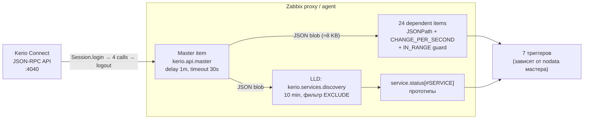
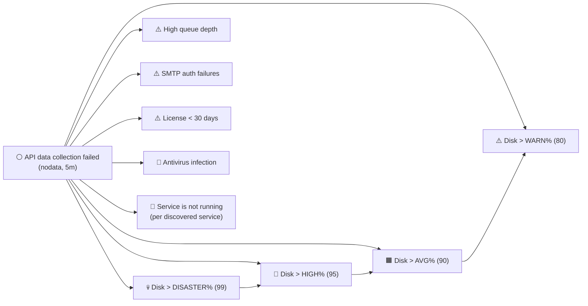

# Zabbix-мониторинг для Kerio Connect

Шаблоны Zabbix 7 для мониторинга почтового сервера **Kerio Connect** через
JSON-RPC Admin API.

📘 [English version](README_EN.md) • 🌐 [itforprof.com](https://itforprof.com)

---

## Архитектура



Один авторизованный сеанс → четыре вызова API → один JSON-объект → 24 зависимых
айтема через JSONPath. LLD создаёт айтем статуса для каждого сервиса.

---

## Что собирается

В одном опросе мастер-айтем выполняет 4 вызова Kerio Admin API
(`Statistics.get`, `Services.get`, `ProductRegistration.getFullStatus`,
`Server.getVersion`) и возвращает JSON-объект, из которого 24 зависимых айтема
извлекают значения через JSONPath. Одно правило LLD создаёт айтемы статуса
для каждого обнаруженного сервиса.

| Метрика | Айтем |
|---|---|
| Объём хранилища (всего/занято/процент) | `kerio.disk.total`, `kerio.disk.used`, `kerio.disk.pct` |
| Очередь сообщений | `kerio.queue.total` |
| Время работы сервера | `kerio.uptime.days` |
| Соединения SMTP/IMAP/POP3/LDAP/Web/XMPP | `kerio.{smtp,imap,pop3,ldap,web,xmpp}.connections` |
| Сообщения SMTP вход/исход | `kerio.smtp.messages.{in,out}` |
| Ошибки SMTP-аутентификации | `kerio.smtp.auth.failures` |
| Спам: проверено/отклонено | `kerio.spam.{checked,rejected}` |
| Антивирус: проверено/найдено | `kerio.av.{scanned,infected}` |
| Greylisting и antibombing | `kerio.greylisting.delayed`, `kerio.antibombing.rejected` |
| Лицензия (пользователи, дни, дата) | `kerio.license.{users,days,expiry}` |
| Версия сервера | `kerio.version` |
| Статус каждого сервиса (LLD) | `kerio.service.status[{#SERVICE}]` |

Все счётчики кумулятивные с момента запуска сервера — для них применяется
`CHANGE_PER_SECOND` со страховкой `IN_RANGE [0, 1e9] DISCARD_VALUE` (на случай
рестарта Kerio: счётчики обнуляются, и без защиты получится отрицательная
дельта).

CPU, память, swap и per-domain метрики **намеренно не включены** — API-методы
`SystemHealth.get` и `Domains.get` недоступны под ролью **Auditor**. Для
системных метрик подключайте параллельно стандартный OS-шаблон Zabbix.

## Триггеры

- ⚪ **API data collection failed** — мастер-айтем не возвращал данных 5 мин.
- ⚠️ **Disk usage > {$KERIO.DISK.WARN}%** — по умолчанию 80 %, Warning.
- 🟧 **Disk usage > {$KERIO.DISK.AVG}%** — по умолчанию 90 %, Average.
- 🔴 **Disk usage > {$KERIO.DISK.HIGH}%** — по умолчанию 95 %, High.
- 💀 **Disk usage > {$KERIO.DISK.DISASTER}%** — по умолчанию 99 %, Disaster;
  при этой отметке Kerio вот-вот перестанет принимать почту. Каждый
  следующий уровень подавляет все нижние, поэтому в проблемах виден только
  один — самой высокой важности.
- ⚠️ **High message queue depth** — очередь больше `{$KERIO.QUEUE.WARN}`.
- ⚠️ **High SMTP authentication failure rate** — частота ошибок
  аутентификации в среднем за 5 мин выше `{$KERIO.SMTP.AUTH.WARN}` в секунду.
- 🔴 **Antivirus infection detected** — KAV обнаружил вредонос.
- ⚠️ **License expires in less than 30 days** — лицензия скоро истекает.
- 🔴 **Service `{#SERVICE}` is not running** — обнаруженный сервис остановлен.

Все триггеры, кроме мастер-«no data», **зависят** от триггера «API data
collection failed». При пропадании API не сработает 16 ложных алертов — только
один корневой.



## Метки (tags)

У шаблона, элементов и LLD-прототипа проставлены теги — удобно фильтровать
Latest data, маршрутизировать уведомления по подсистемам и строить дашборды.

| Где | Тег | Значение |
|---|---|---|
| Шаблон | `class` | `application` |
| Шаблон | `target` | `kerio-connect` |
| Мастер-айтем | `component` | `raw` |
| Зависимые айтемы | `component` | `storage` · `queue` · `smtp` · `imap` · `pop3` · `ldap` · `web` · `xmpp` · `antispam` · `antivirus` · `greylisting` · `anti-bombing` · `license` · `health` · `info` |
| Прототип сервиса | `component` | `services` |
| Прототип сервиса | `service` | `{#SERVICE}` (имя обнаруженного сервиса) |

## Два варианта шаблона

### Вариант 1 — `Kerio Connect by Script`

Zabbix server или proxy сам ходит в Kerio API. Никаких агентов не нужно.
Подходит, когда из proxy/server есть прямой доступ к `https://<kerio>:4040/`.

Установите макросы на хосте:

| Макрос | Значение |
|---|---|
| `{$KERIO.API.HOST}` | IP/имя сервера Kerio |
| `{$KERIO.API.PORT}` | `4040` |
| `{$KERIO.API.SCHEME}` | `https` |
| `{$KERIO.API.USERNAME}` | служебный пользователь (роль Auditor достаточна) |
| `{$KERIO.API.PASSWORD}` | пароль (Secret macro) |

### Вариант 2 — `Kerio Connect by Zabbix agent`

Опрос выполняет агент на самой машине через UserParameter →
`kerio_collector.py`. Учётные данные читаются из локального файла на агенте,
**не из конфига агента и не из макросов Zabbix**.

```bash
install -m 0755 src/kerio_collector.py /opt/zabbix-kerio-connect/src/kerio_collector.py
install -m 0644 template/kerio_connect_agent/zabbix_agent2.d/kerio_connect.conf \
                /etc/zabbix/zabbix_agent2.d/kerio_connect.conf
```

`/etc/zabbix/kerio_connect.conf` (chmod 0600, владелец `zabbix:zabbix`):

```ini
[api]
host = 127.0.0.1
port = 4040
scheme = https
username = zabbix_api
password = <секрет>
```

В `/etc/zabbix/zabbix_agent2.conf` **обязательно** установите `Timeout=30`
(или больше) — четыре HTTPS-запроса с авторизацией не успевают за 3 секунды
по умолчанию.

Перезапустите агента и привяжите шаблон к хосту.

## Макрос исключения сервисов

`{$KERIO.SERVICES.EXCLUDE}` — регулярное выражение, под которое **не**
дискаверятся сервисы. По умолчанию `^$` (исключений нет).

Регулярка якорная, поэтому варианты `Secure …` (Secure POP3, Secure HTTP, …)
нужно перечислять отдельно, если их тоже не нужно мониторить.

Пример — хост, на котором POP3, HTTP, XMPP, NNTP и Secure NNTP / Secure XMPP
выставлены в Manual:

```
{$KERIO.SERVICES.EXCLUDE}=^(POP3|HTTP|XMPP|NNTP|Secure NNTP|Secure XMPP)$
```

## Установка

1. Создайте служебного пользователя в Kerio Admin с ролью **Auditor** (Admin
   тоже подойдёт, но Auditor минимально достаточен).
2. Импортируйте YAML шаблона в Zabbix:
   `Configuration → Templates → Import`.
3. Привяжите выбранный шаблон к хосту, заполните макросы.
4. Через минуту проверьте `Monitoring → Latest data` — должны появиться
   значения дисков, лицензии, версии и т. д. Счётчики CHANGE_PER_SECOND
   станут не-нулевыми после второго опроса.

## Проверено на

Kerio Connect 10.0.8.9228 (Windows), роль API-пользователя Auditor,
Zabbix 7.0, опрос через Zabbix proxy.

## Разработка

```bash
pytest tests/ -v --ignore=tests/test_deployment.py    # 60 юнит-тестов
node --check src/master_collector.js
node --check src/lld_services.js
python3 tools/sync_template_js.py --check             # JS ↔ YAML параллель
```

Подробное описание API-полей и JSONPath: [docs/api_fields.md](docs/api_fields.md).

## Лицензия и автор

Автор: **Konstantin Tyutyunnik** (Константин Тютюнник) ·
[itforprof.com](https://itforprof.com)

Версия шаблона: **1.0.0**
