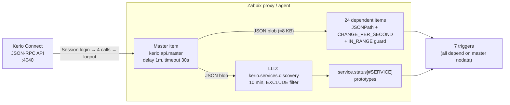
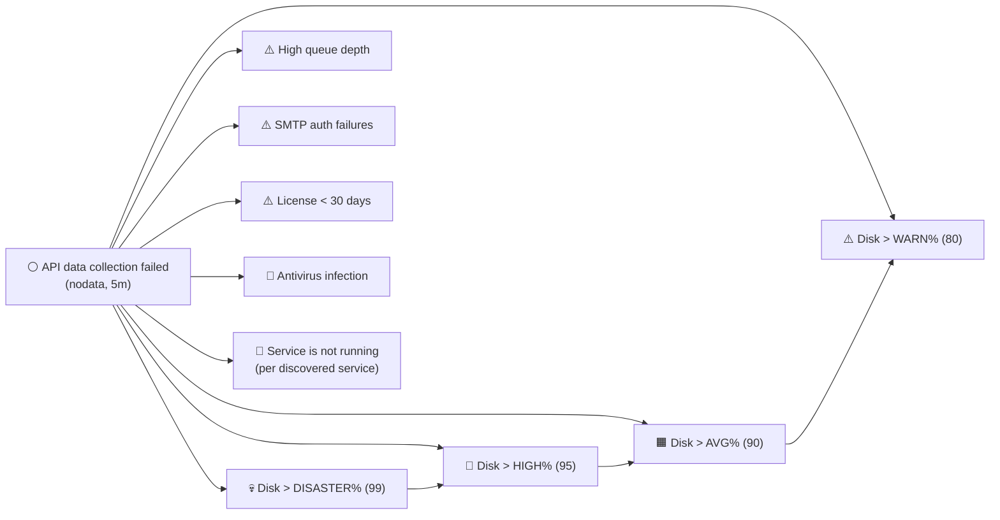

# Zabbix monitoring for Kerio Connect

Zabbix 7 templates that monitor a **Kerio Connect** mail server through its
JSON-RPC Admin API.

📕 [Русская версия](README.md) • 🌐 [itforprof.com](https://itforprof.com)

---

## Architecture



One authenticated session → four API calls → one JSON blob → 24 dependent
items via JSONPath. LLD creates a status item per discovered service.

---

## What it collects

The master item performs four Kerio Admin API calls per poll
(`Statistics.get`, `Services.get`, `ProductRegistration.getFullStatus`,
`Server.getVersion`) and returns one JSON blob. 24 dependent items extract
values via JSONPath. A single LLD rule creates a service-status item per
discovered service.

| Metric | Item key |
|---|---|
| Storage (total / used / percent) | `kerio.disk.total`, `kerio.disk.used`, `kerio.disk.pct` |
| Mail queue depth | `kerio.queue.total` |
| Server uptime (days) | `kerio.uptime.days` |
| Connections (SMTP/IMAP/POP3/LDAP/Web/XMPP) | `kerio.{smtp,imap,pop3,ldap,web,xmpp}.connections` |
| SMTP messages in/out | `kerio.smtp.messages.{in,out}` |
| SMTP authentication failures | `kerio.smtp.auth.failures` |
| Spam checked / rejected | `kerio.spam.{checked,rejected}` |
| Antivirus scanned / infected | `kerio.av.{scanned,infected}` |
| Greylisting and antibombing | `kerio.greylisting.delayed`, `kerio.antibombing.rejected` |
| License (users, days, expiry) | `kerio.license.{users,days,expiry}` |
| Server version | `kerio.version` |
| Per-service status (LLD) | `kerio.service.status[{#SERVICE}]` |

Counters are cumulative since server start. `CHANGE_PER_SECOND` produces
per-second rates, with `IN_RANGE [0, 1e9] DISCARD_VALUE` to suppress the
negative delta that would otherwise appear after a Kerio restart resets the
counter to zero.

CPU, memory, swap and per-domain metrics are **intentionally omitted** — the
`SystemHealth.get` and `Domains.get` API methods are not available to the
**Auditor** role. Use a regular Zabbix OS template (Windows / Linux) alongside
for system metrics.

## Triggers

- ⚪ **API data collection failed** — master item produced no data for 5 min.
- ⚠️ **Disk usage > {$KERIO.DISK.WARN}%** — 80 % default, Warning.
- 🟧 **Disk usage > {$KERIO.DISK.AVG}%** — 90 % default, Average.
- 🔴 **Disk usage > {$KERIO.DISK.HIGH}%** — 95 % default, High.
- 💀 **Disk usage > {$KERIO.DISK.DISASTER}%** — 99 % default, Disaster;
  at this point Kerio is about to stop accepting messages. Each higher tier
  suppresses all lower tiers, so you get one alert at the highest level.
- ⚠️ **High message queue depth** — queue size above `{$KERIO.QUEUE.WARN}`.
- ⚠️ **High SMTP authentication failure rate** — 5-minute average of
  auth-failure rate exceeds `{$KERIO.SMTP.AUTH.WARN}` per second.
- 🔴 **Antivirus infection detected** — Kerio AV flagged a message.
- ⚠️ **License expires in less than 30 days** — renew soon.
- 🔴 **Service `{#SERVICE}` is not running** — a discovered service is stopped.

Every trigger except the master *no-data* trigger **depends** on “API data
collection failed”. When the API goes down only that single root alert fires
instead of cascading 16 false-positives.



## Tags

Items, triggers and the LLD prototype carry tags so you can filter Latest
data, route notifications by subsystem, or scope dashboards.

| Scope | Tag | Value |
|---|---|---|
| Template | `class` | `application` |
| Template | `target` | `kerio-connect` |
| Master item | `component` | `raw` |
| Dependent items | `component` | `storage` · `queue` · `smtp` · `imap` · `pop3` · `ldap` · `web` · `xmpp` · `antispam` · `antivirus` · `greylisting` · `anti-bombing` · `license` · `health` · `info` |
| Service prototype | `component` | `services` |
| Service prototype | `service` | `{#SERVICE}` (discovered service name) |

## Two template flavours

### Variant 1 — `Kerio Connect by Script`

Zabbix server or proxy calls the Kerio API directly. No agent required. Use
this when the proxy/server can reach `https://<kerio>:4040/`.

Set host macros:

| Macro | Value |
|---|---|
| `{$KERIO.API.HOST}` | Kerio host or IP |
| `{$KERIO.API.PORT}` | `4040` |
| `{$KERIO.API.SCHEME}` | `https` |
| `{$KERIO.API.USERNAME}` | service user (Auditor role is enough) |
| `{$KERIO.API.PASSWORD}` | password (Secret macro) |

### Variant 2 — `Kerio Connect by Zabbix agent`

A Zabbix agent on the host runs `kerio_collector.py` via a UserParameter.
Credentials live in a local config file — **not** in `zabbix_agent2.conf`,
because Zabbix host macros are not expanded inside that file.

```bash
install -m 0755 src/kerio_collector.py /opt/zabbix-kerio-connect/src/kerio_collector.py
install -m 0644 template/kerio_connect_agent/zabbix_agent2.d/kerio_connect.conf \
                /etc/zabbix/zabbix_agent2.d/kerio_connect.conf
```

Create `/etc/zabbix/kerio_connect.conf` (chmod `0600`, owner `zabbix:zabbix`):

```ini
[api]
host = 127.0.0.1
port = 4040
scheme = https
username = zabbix_api
password = <secret>
```

In `/etc/zabbix/zabbix_agent2.conf` you **must** set `Timeout=30` (or higher)
— four HTTPS calls with login don’t fit in the default 3 seconds.

Restart the agent and link the template to the host.

## Excluding services

`{$KERIO.SERVICES.EXCLUDE}` is a regex matched against discovered service
names; matching services are not monitored. Default `^$` matches nothing
(every service is monitored).

The regex is anchored, so `Secure …` variants (Secure POP3, Secure HTTP, …)
must be listed separately if you want them excluded too.

Example — host with POP3, HTTP, XMPP, NNTP and Secure NNTP / Secure XMPP all
configured Manual:

```
{$KERIO.SERVICES.EXCLUDE}=^(POP3|HTTP|XMPP|NNTP|Secure NNTP|Secure XMPP)$
```

## Installation

1. Create a Kerio Admin service user with the **Auditor** role (Admin works
   too, but Auditor is the minimum).
2. Import the YAML template in Zabbix:
   `Configuration → Templates → Import`.
3. Link the template to the host and set the macros.
4. After one minute, check `Monitoring → Latest data` — disk, license,
   version etc. should be populated. `CHANGE_PER_SECOND` counters become
   non-zero after the second poll cycle.

## Verified against

Kerio Connect 10.0.8.9228 (Windows), API user with Auditor role, Zabbix 7.0,
collection via Zabbix proxy.

## Development

```bash
pytest tests/ -v --ignore=tests/test_deployment.py    # 60 unit tests
node --check src/master_collector.js
node --check src/lld_services.js
python3 tools/sync_template_js.py --check             # JS ↔ YAML parity
```

Detailed field/JSONPath reference: [docs/api_fields.md](docs/api_fields.md).

## License & author

Author: **Konstantin Tyutyunnik** (Константин Тютюнник) ·
[itforprof.com](https://itforprof.com)

Template version: **1.0.0**
